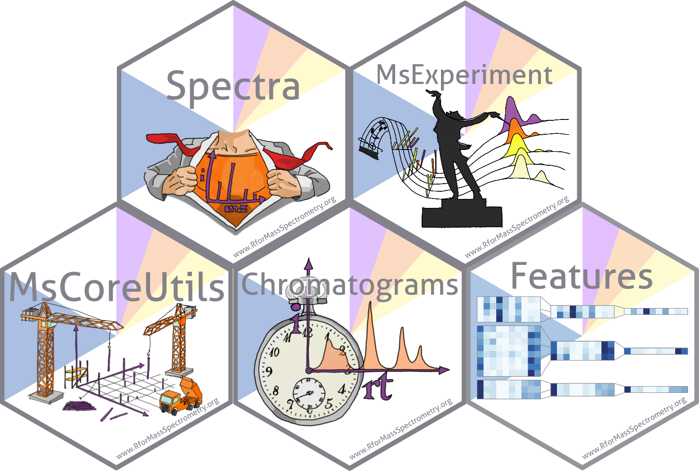
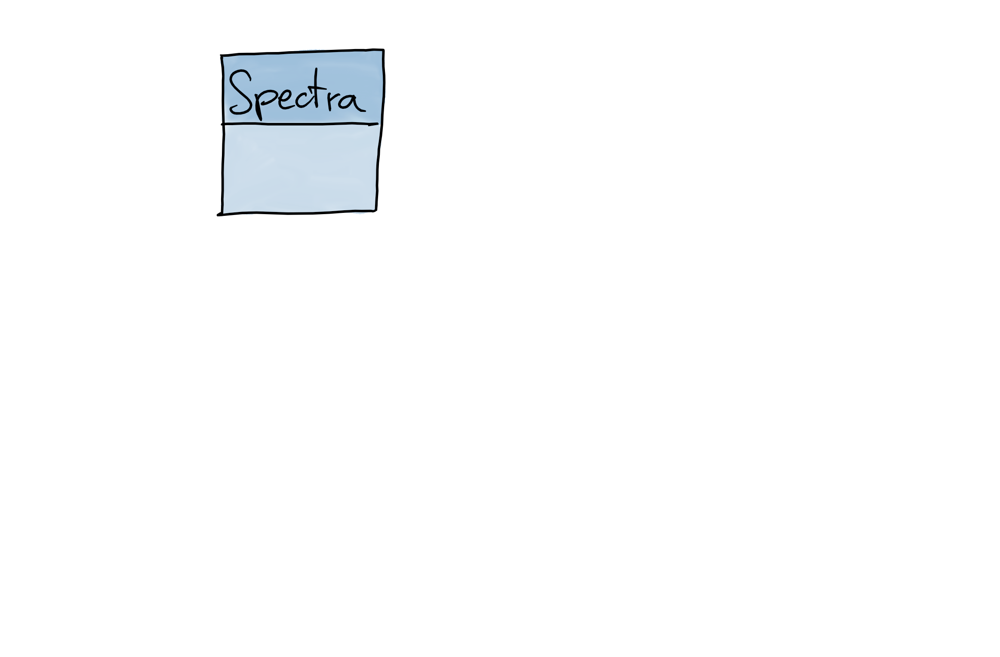
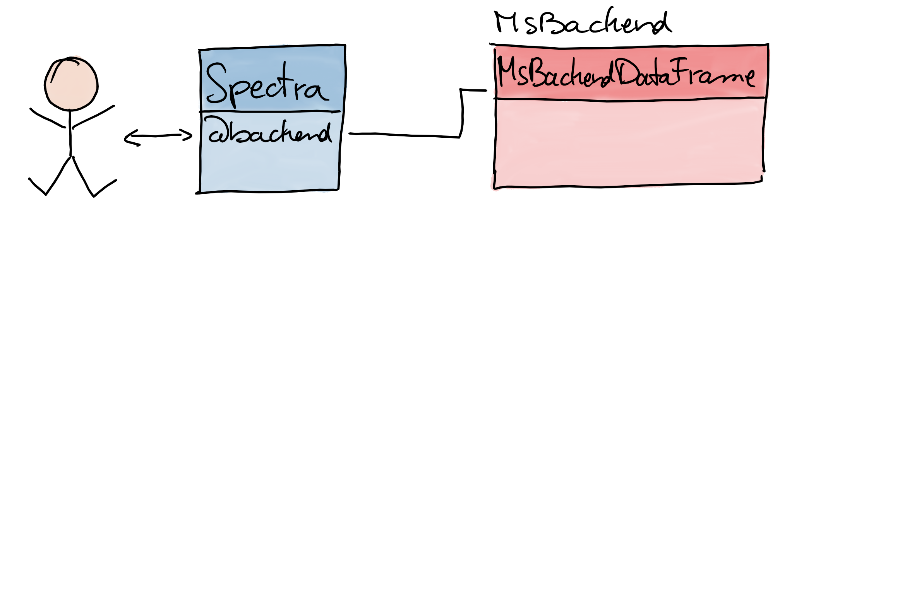
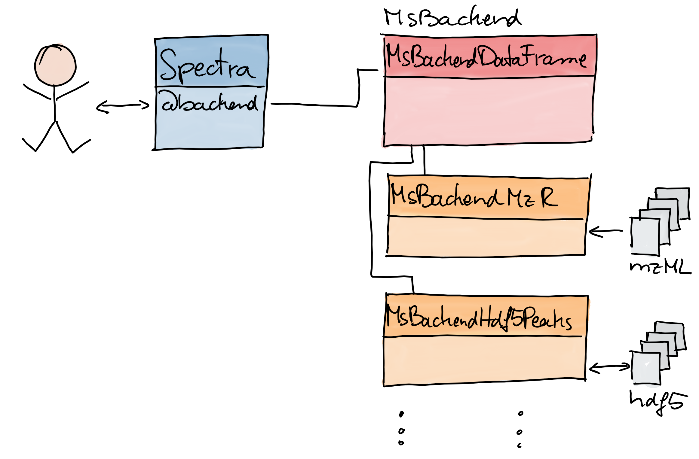

<style type="text/css">

slides > slide:not(.nobackground):after {
  content: '';
}

slides > slide {
    -webkit-transition:none !important;transition:none !important;
}

.build > * {
  -webkit-transition: opacity 0.1s ease-in-out;
  -webkit-transition-delay: 0.1s;
  -moz-transition: opacity 0.1s ease-in-out 0.1s;
  -o-transition: opacity 0.1s ease-in-out 0.1s;
  transition: opacity 0.1s ease-in-out 0.1s;
}

</style>

<!--
Export to pdf:
webshot function from webshot package.
Might have to change stuff in the style sheet to make it working.
library(webshot)
install_phantomjs()
rmdshot("Spectra.Rmd", "Spectra.pdf")
-->

##

```{r out.width = "480px", echo = FALSE}
knitr::include_graphics("images/Spectra.png")
```

## RforMassSpectrometry

```{r out.width = "520px", echo = FALSE}

```

- [Initiative](https://www.rformassspectrometry.org) to create a
  flexible and scalable infrastructure for MS data.
- See Laurent Gatto's [poster](https://doi.org/10.5281/zenodo.3565530) for
  details.

## Mass spectrum {.build}

<div>
<div>
```{r out.width = "500px", echo = FALSE}

```
</div>
<div style="position:absolute; top:55%; left:7%;">
- Spectrum:
  - 2 `numeric`: m/z and intensity values.
  - additional metadata information.
- `MSnbase`: `Spectrum` object for a single spectrum.
</div>
</div>

## Mass spectrum

<div>
```{r out.width = "500px", echo = FALSE}

```
... but usually we deal with many spectra ...
</div>

## Think bigger: `Spectra`

<div>
```{r out.width = "500px", echo = FALSE}

```
</div>

<div style="position:absolute; top:70%;">
- One object to represent data from one or many spectra.
</div>

## Think flexible: `MsBackend`

<div>
```{r out.width = "500px", echo = FALSE}

```
</div>

<div style="position:absolute; top:70%;">
- Separate user functionality from data handling and storage.
</div>

## Think flexible: `MsBackend`

<div>
```{r out.width = "500px", echo = FALSE}

```
</div>

<div style="position:absolute; top:70%;">
- Separate user functionality from data handling and storage.
- Enables use of different *backends* (in-memory/on-disk, remote files,
  SQL-based, ...).
</div>

## Example: data import {.smaller .build}

- Import data from an *mzML* file.

```{r, message = FALSE}
library(Spectra)
library(magrittr)

sps <- Spectra("data/20191107_Mix2_CE20.mzML", backend = MsBackendMzR())
sps
```

## Example: data subsetting {.smaller .build}

- Select all MS2 spectra for a [M+H]+ ion of Histidine.

```{r}
mz_hist <- 156.07675 # Histidine
ms2_hist <- sps %>%
    filterMsLevel(2) %>%
    filterPrecursorMz(mz = mz_hist + ppm(c(-mz_hist, mz_hist), 20))
ms2_hist
```

## Example: data processing {.smaller .build}

```{r, warning = FALSE, message = FALSE}
ms2_hist <- ms2_hist %>%
    pickPeaks() %>%
    removePeaks(threshold = 500) %>%
    clean(all = TRUE)
ms2_hist
```

- Data manipulations applied *on-the-fly*.

<!-- ## Example: change backend {.smaller .build} -->

<!-- <div> -->
<!-- - Change backend: load data into memory. -->

<!-- ```{r, warning = FALSE, message = FALSE} -->
<!-- ms2_hist <- setBackend(ms2_hist, MsBackendDataFrame()) -->
<!-- ms2_hist -->
<!-- ``` -->
<!-- </div> -->

## Example: use custom backend {.smaller .build}

<div>
- Import reference spectra from [HMDB](http://www.hmdb.ca).

```{r read-hmdb, eval = FALSE}
library(MsBackendHmdb)
fls <- dir("data/hmdb_all_spectra", full.names = TRUE, pattern = "ms_ms_")
hmdb <- Spectra(fls, source = MsBackendHmdbXml(), nonStop = TRUE)
hmdb
```

```{r load-hmdb, eval = file.exists("data/hmdb.RData"), echo = FALSE}
load("data/hmdb.RData")
```
</div>
<div>
```{r, echo = FALSE}
hmdb
```
</div>

## Example: compare spectra {.smaller .build}

<div>
- Match spectrum against database.

```{r, echo = FALSE}
#' Doing a little cheating because matching against all takes too long
hmdb_all <- hmdb
hmdb <- hmdb[hmdb$compound_id == "HMDB0000177"]
```

```{r}
res <- compareSpectra(ms2_hist, hmdb, ppm = 40)
hmdb$compound_id[res > 0.7]
```
</div>
<div>
```{r, echo = FALSE, fig.width = 8, fig.height = 3.5, message = FALSE, warning = FALSE}
library(MSnbase)
sp1 <- new("Spectrum2", mz = ms2_hist$mz[[1]],
           intensity = ms2_hist$intensity[[1]],
           precursorMz = ms2_hist$precursorMz,
           centroided = TRUE)
idx <- which(res > 0.7)
sp2 <- new("Spectrum2", mz = hmdb$mz[[idx[1]]],
           intensity = hmdb$intensity[[idx[1]]],
           centroided = TRUE)
par(mar = c(4.5, 4.5, 0.5, 0.5))
plot(sp1, sp2, tolerance = 40e-6)
```
</div>


##

<div style="position:absolute; left:5%; top:40%;font-size: 180%;">
**See Sebastian Gibb's [poster](https://doi.org/10.5281/zenodo.3565537) for details**
</div>
